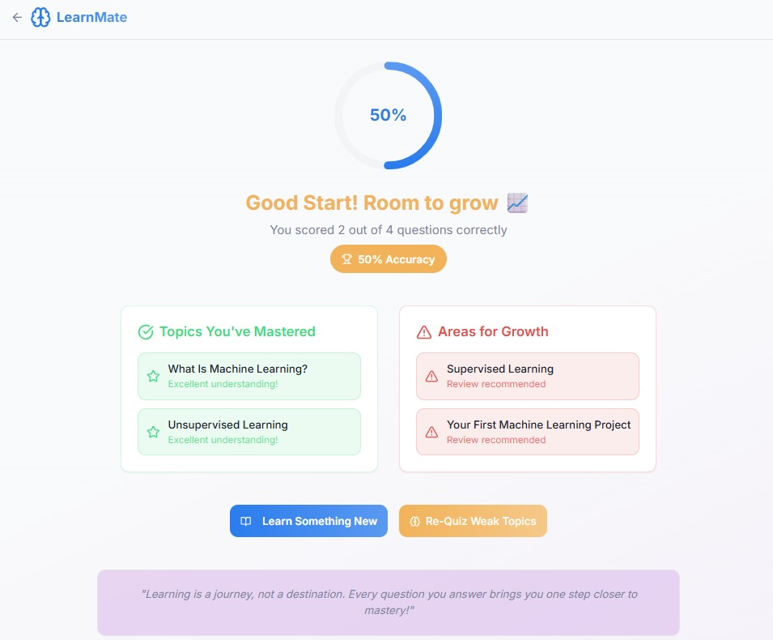

# LearnMate

**LearnMate** is an Agentic AI-powered learning assistant that creates personalized learning paths and dynamically quizzes users to reinforce their knowledge. It aligns with **UN SDG 4: Quality Education**, helping learners gain structured and meaningful insights on any topic.

**[Live Website](https://learn-mate-pi.vercel.app/)**  
**[Backend Repository](https://github.com/StreetC0der/learn-mate-server)**


---

## Table of Contents
- [Overview](#overview)
- [Tech Stack](#tech-stack)
- [Features](#features)
- [Workflow Diagram](#workflow-diagram)
- [Screenshots](#screenshots)
- [Setup Instructions](#setup-instructions)

---

## Overview

LearnMate empowers users to enter any topic of interest, automatically generates a curated learning path with real-time resources, and quizzes them to reinforce knowledge. It adapts to the user’s performance by re-quizzing weak areas, creating an engaging learning loop.

---

## Tech Stack

- **Frontend**: React.js, TailwindCSS, TypeScript, Zustand
- **Backend**: FastAPI, Python, Langchain
- **LLM Tools**: Tavily Search API, Gemini, Groq (via Langchain)
- **Deployment**: Vercel (Frontend), Railway (Backend)

---

## Features

- Real-time topic curation with sub-topics and resource links
- AI-generated MCQs with explanations
- Personalized feedback with topic-wise analysis
- Re-quiz on weak topics to reinforce learning
- Lightweight, fast and free-to-use

---

## Workflow Diagram


---

## Screenshots

### Landing Page `/`
> Beautiful, modern interface with overview


### Learn Page `/learn`
> Input topic → AI returns sub-topics with curated links


### Quiz Page `/quiz`
> Auto-generated questions with multiple choices


### Assessment Page `/assessments`
> Score, progress indicator, and re-quiz option



---

## Setup Instructions

```bash
# 1. Install dependencies
npm install

# 2. Start the development server
npm run dev
```

> Rename the .env.example to .env

> Make sure to set up the backend as well by following the instructions given in the backend repo
